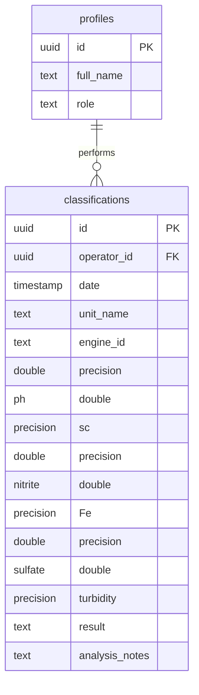
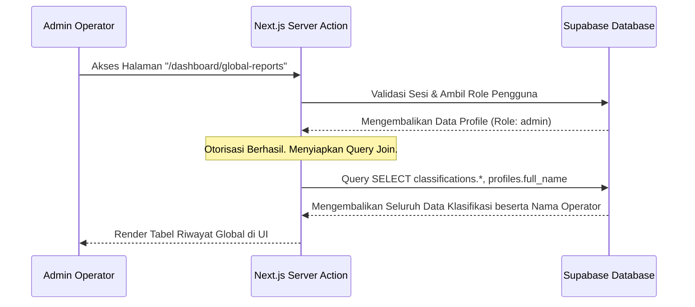

# Rencana Implementasi (Planning) Fitur Pemantauan Riwayat Klasifikasi Global (Admin)
**Sistem Monitoring Kualitas Cooling Water — PT PLN Nusantara Power UP Arun**

Dokumen ini menjelaskan rencana teknis untuk mengimplementasikan fitur pemantauan riwayat klasifikasi kualitas air pendingin (*cooling water*) dari seluruh pengguna terdaftar. Fitur ini dirancang khusus untuk pengguna dengan peran **Admin** agar dapat melakukan pengawasan menyeluruh terhadap seluruh aktivitas analisis yang dilakukan di sistem.

---

## 📌 Analisis Kondisi Saat Ini (Current State)

Saat ini, sistem memiliki halaman Riwayat Analisis di `/dashboard/reports` yang menampilkan data klasifikasi. Namun, terdapat beberapa hal yang perlu ditingkatkan terkait pemisahan hak akses dan pengawasan data:

1. **Belum Ada Pemisahan Hak Akses Riwayat (Multi-user Privacy)**
   * Saat ini, query pengambilan data di halaman `/dashboard/reports` menarik semua baris dari tabel `classifications` tanpa menyaring berdasarkan ID pengguna yang sedang login (`operator_id`).
   * **Dampak:** Operator biasa dapat melihat hasil input operator lainnya. Di lingkungan operasional yang ideal, operator sebaiknya hanya melihat laporan mereka sendiri untuk menjaga akuntabilitas, sedangkan admin memiliki akses global.

2. **Ketiadaan Informasi Operator di Tabel Riwayat**
   * Riwayat saat ini hanya menampilkan parameter teknis dan status kelayakan tanpa menyertakan kolom **Nama Operator** yang melakukan klasifikasi tersebut.
   * **Dampak:** Admin kesulitan mengidentifikasi siapa yang menginput data tertentu ketika terjadi anomali atau kesalahan input data kualitas air.

---

## 🛠️ Desain Arsitektur UI/UX

Berdasarkan kebutuhan untuk memisahkan pengawasan global dari riwayat pribadi, kita akan **membuat halaman baru khusus Admin**.

### Pembuatan Halaman Baru: `/dashboard/global-reports` (Riwayat Klasifikasi Global)
* **Konsep:** Halaman mandiri ini didedikasikan bagi Admin untuk memantau data klasifikasi seluruh sistem secara penuh. Halaman ini mirip secara struktur dengan halaman `/dashboard/reports`, namun dengan cakupan data keseluruhan (global).
* **Visibilitas (Role-based Access):**
  * **Admin:** Halaman ini dapat diakses secara langsung dan menu nav-nya **akan muncul** di sidebar navigasi.
  * **Operator:** Fitur/halaman ini akan di-**hidden** (disembunyikan) dari sidebar navigasi untuk pengguna dengan role operator. Jika operator memaksa mengakses URL secara langsung, sistem akan memblokir dan menampilkan halaman *Akses Ditolak* (seperti pada `/dashboard/master-data`).
* **Kelebihan:** 
  * Pemisahan fungsi (separation of concerns) yang sangat jelas antara riwayat pribadi (operator) dan pengawasan global (admin).
  * Menghindari kepadatan (clutter) antarmuka pada halaman Kelola Master Data.

## 📊 Alur Data & Keamanan

### 1. Struktur Relasi Tabel Database
Untuk menampilkan nama lengkap operator, tabel `classifications` yang memiliki kolom `operator_id` harus dihubungkan dengan tabel `profiles` (`id`).



### 2. Alur Query Data
Proses otentikasi dan otorisasi dilakukan di tingkat Next.js Server Actions dan didukung oleh Row Level Security (RLS) Supabase:



---

## 📋 Detail Rencana Kerja (Langkah Teknis)

### Tahap 1: Pembaruan Keamanan Database (Supabase SQL)
Kita perlu memperbarui policy RLS untuk tabel `classifications`. Kebijakan baru harus memastikan operator hanya dapat membaca data mereka sendiri, sedangkan admin dapat membaca seluruh data.

```sql
-- 1. Aktifkan RLS pada tabel classifications
ALTER TABLE public.classifications ENABLE ROW LEVEL SECURITY;

-- 2. Hapus policy SELECT lama jika ada
DROP POLICY IF EXISTS "Allow select for owners" ON public.classifications;
DROP POLICY IF EXISTS "Allow select all for admin" ON public.classifications;
DROP POLICY IF EXISTS "Allow insert for authenticated users" ON public.classifications;

-- 3. Policy: User biasa hanya bisa membaca data miliknya sendiri
CREATE POLICY "Allow select for owners" ON public.classifications
    FOR SELECT TO authenticated
    USING (
        auth.uid() = operator_id
    );

-- 4. Policy: Admin bisa membaca seluruh data klasifikasi
CREATE POLICY "Allow select all for admin" ON public.classifications
    FOR SELECT TO authenticated
    USING (
        EXISTS (
            SELECT 1 FROM public.profiles
            WHERE profiles.id = auth.uid() AND profiles.role = 'admin'
        )
    );

-- 5. Policy: Mengizinkan insert data untuk semua user terautentikasi
CREATE POLICY "Allow insert for authenticated users" ON public.classifications
    FOR INSERT TO authenticated
    WITH CHECK (
        auth.uid() = operator_id
    );
```

### Tahap 2: Implementasi Server Action untuk Riwayat Global
Membuat fungsi server action untuk mengambil riwayat klasifikasi seluruh user secara aman. Fungsi ini akan memverifikasi apakah pemanggil adalah Admin.

```typescript
// app/dashboard/global-reports/actions.ts

'use server'

import { createClient } from '@/lib/supabase/server'

// Helper cek role admin
async function checkAdmin() {
  const supabase = await createClient()
  const { data: { user } } = await supabase.auth.getUser()
  if (!user) return false

  const { data: profile } = await supabase
    .from('profiles')
    .select('role')
    .eq('id', user.id)
    .single()

  return profile?.role === 'admin'
}

export async function getAllClassifications() {
  if (!(await checkAdmin())) {
    return { success: false, error: 'Unauthorized' }
  }

  const supabase = await createClient()

  // Ambil data klasifikasi beserta nama lengkap operator dari tabel profiles
  const { data, error } = await supabase
    .from('classifications')
    .select(`
      *,
      profiles:operator_id (
        full_name
      ),
      iron:Fe
    `)
    .order('date', { ascending: false })

  if (error) {
    console.error("Gagal mengambil data riwayat global:", error)
    return { success: false, error: error.message }
  }

  // Flatten the result for the data table
  const formattedData = data.map((item: any) => ({
    ...item,
    operator_name: item.profiles?.full_name || 'Operator Tidak Dikenal'
  }))

  return { success: true, data: formattedData }
}
```

### Tahap 3: Modifikasi Sidebar Navigasi
Menambahkan link halaman Riwayat Global di sidebar (`components/app-sidebar.tsx`) yang hanya dirender untuk role Admin.

```tsx
// Penambahan pada data navMain
{
  title: "Riwayat Semua User",
  url: "/dashboard/global-reports",
  icon: <IconReportAnalytics />,
}

// Sidebar akan memfilter array ini sehingga hanya Admin yang dapat melihat item tersebut.
```

### Tahap 4: Implementasi UI Halaman Riwayat Global (`app/dashboard/global-reports/page.tsx`)
Membuat file page baru khusus untuk merender tabel data beserta fitur search dan filter berdasarkan Operator.

```tsx
// Draft implementasi app/dashboard/global-reports/page.tsx
'use client'

import { useEffect, useState } from 'react'
import { getAllClassifications } from './actions'
// Import DataTable, dsb...

export default function GlobalReportsPage() {
  const [data, setData] = useState([])
  const [isAdmin, setIsAdmin] = useState(false)

  // Fetch logic memanggil getAllClassifications()
  // ...

  // Tampilkan page Akses Ditolak jika bukan Admin
  if (!isAdmin) return <AccessDeniedPage />

  return (
    <div>
      <h1>Riwayat Klasifikasi Global</h1>
      <DataTable columns={columns} data={data} />
    </div>
  )
}
```

---

## 🧪 Rencana Pengujian & Verifikasi (Testing Plan)

Untuk memastikan fitur ini berjalan dengan aman dan fungsional, pengujian akan dilakukan berdasarkan skenario berikut:

| Skenario Pengujian | Hasil yang Diharapkan | Status |
| :--- | :--- | :--- |
| **Login sebagai Operator biasa** | Menu "Riwayat Semua User" tersembunyi. Akses langsung ke rute `/dashboard/global-reports` tidak diizinkan. Di `/dashboard/reports`, operator hanya melihat datanya sendiri. | Rencana |
| **Login sebagai Admin** | Dapat mengakses `/dashboard/global-reports` melalui menu navigasi, dan tabel muncul menampilkan data dari seluruh operator terdaftar beserta nama lengkap mereka. | Rencana |
| **Pengujian Pencarian / Filter** | Input nama operator "Ahmad" di kolom pencarian tabel global hanya memunculkan baris analisis yang diinput oleh Ahmad. | Rencana |
| **Keamanan RLS Direct Query** | Percobaan eksekusi SELECT langsung ke REST API Supabase menggunakan token JWT Operator tidak mengembalikan baris milik user lain. | Rencana |

---

## 📈 Rencana Rilis (Release Plan)

1. **Database Migration:** Eksekusi skrip kebijakan RLS baru untuk tabel `classifications` melalui SQL Editor Supabase.
2. **Deploy Code:** Lakukan push perubahan Next.js ke repositori produksi setelah verifikasi lokal berhasil.
3. **Verifikasi Post-Release:** Lakukan login uji coba menggunakan akun operator simulasi dan akun admin untuk memastikan hak akses data telah terisolasi dengan sempurna.