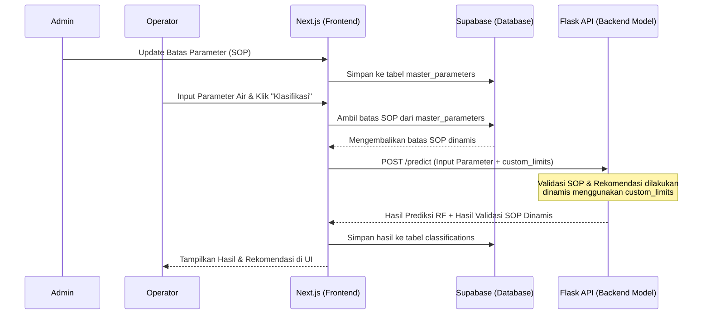

# Rencana Implementasi (Planning) Penyesuaian Fitur Master Data
**Sistem Monitoring Kualitas Cooling Water — PT PLN Nusantara Power UP Arun**

Dokumen ini berisi rencana teknis untuk menyelesaikan integrasi antara modul **Master Data** (Unit, Engine, dan Parameter SOP) dengan alur kerja **Klasifikasi Kualitas Air** baik di frontend Next.js maupun backend Python (Flask).

---

## 📌 Analisis Kondisi Saat Ini (Current State)

Saat ini, sistem telah memiliki modul pengelolaan Master Data yang dapat diakses oleh Admin di `/dashboard/master-data`. Namun, terdapat celah integrasi (*gaps*) antara data master yang disimpan di database Supabase dengan logika penentuan kelayakan di sistem:

1. **Logika Validasi SOP di Backend Masih Hardcoded**
   * Admin dapat mengubah batas normal parameter (misalnya batas pH atau SC) di antarmuka admin. Perubahan ini tersimpan di tabel `master_parameters` Supabase.
   * Nilai batas baru berhasil ditampilkan sebagai label petunjuk di form input `/dashboard/input`.
   * **Masalah Utama:** Proses klasifikasi sesungguhnya dikerjakan oleh backend Python (Flask API) melalui endpoint `/predict`. Backend Python tersebut masih menggunakan batas parameter yang di-*hardcode* di dalam berkas `model.py` (`BATAS_SOP` dict).
   * **Dampak:** Jika admin mengubah batas pH menjadi `7.5 - 10.5` di database, label pada form Next.js akan berubah, tetapi backend Python akan tetap menganggap pH di luar `8.0 - 11.0` sebagai "Tidak Layak" dan memberikan rekomendasi yang salah berdasarkan batas lama.

2. **Sinkronisasi Unit & Engine**
   * Halaman input data sudah secara dinamis memuat daftar Unit dan Engine dari tabel `master_units` dan `master_engines`.
   * Namun, mekanisme penanganan kegagalan (*fallback*) masih menggunakan nilai statis jika database sedang tidak aktif atau belum diinisialisasi. Perlu dipastikan penanganan ini berjalan mulus tanpa merusak UX.

---

## 🛠️ Solusi yang Diusulkan (Proposed Solution)

Untuk menyelaraskan data batas SOP dinamis dari database Supabase dengan backend Python secara efisien tanpa memerlukan koneksi langsung dari Hugging Face ke Supabase (yang membutuhkan konfigurasi kredensial tambahan di Hugging Face Space), kita akan menggunakan metode **Payload Injection (Parameter Terkirim)**:

1. **Next.js Server Action (`processClassification`)**:
   Sebelum mengirim data parameter air ke Flask API untuk diprediksi, Next.js akan mengambil batas SOP terbaru dari tabel `master_parameters` di database. Batas ini kemudian dikirim bersama payload prediksi sebagai objek JSON `custom_limits`.
   
2. **Flask API Backend (`predict` & `prediksi_air`)**:
   Mengubah backend Python agar mendeteksi keberadaan `custom_limits` di dalam request body POST. Jika dikirim oleh Next.js, backend akan menggunakan batas tersebut untuk mengevaluasi SOP, membuat detail hasil validasi, dan menyusun teks rekomendasi tindakan secara dinamis. Jika tidak dikirim, backend akan menggunakan batas bawaan (*fallback*).



---

## 📋 Detail Rencana Kerja (Milestones & Langkah Teknis)

### Tahap 1: Penyesuaian Backend Python (Repositori `RANDOM_FOREST`)

Perubahan difokuskan pada berkas `model.py` dan `app.py` agar dapat menerima batas parameter kustom.

#### 1. Modifikasi `model.py`
Ubah fungsi-fungsi pembantu validasi agar menerima parameter `batas_sop` yang dikirim dari luar.

```python
# model.py (Proposed Changes)

# Batas default jika tidak dikirim dari Next.js (fallback)
BATAS_SOP_DEFAULT = {
    'pH': (8.0, 11.0),
    'SC': (0.0, 6000.0),
    'Nitrite': (500.0, 1500.0),
    'Fe': (0.0, 1.0),
    'Sulfate': (0.0, 100.0),
    'Turbidity': (0.0, 30.0)
}

def validasi_sop(data, batas_sop=None):
    """Mengevaluasi kelayakan air berdasarkan batas SOP"""
    limits = batas_sop if batas_sop is not None else BATAS_SOP_DEFAULT
    pelanggaran = []
    
    for param, nilai in data.items():
        if param in limits:
            min_val, max_val = limits[param]
            if not (min_val <= nilai <= max_val):
                pelanggaran.append(f"{param} ({nilai}) di luar batas {min_val}--{max_val}")
                
    if pelanggaran:
        return "Tidak Layak", pelanggaran
    return "Layak", []

def detail_validasi(data, batas_sop=None):
    """Menyusun status detail untuk setiap parameter"""
    limits = batas_sop if batas_sop is not None else BATAS_SOP_DEFAULT
    hasil = {}
    
    for param, nilai in data.items():
        if param in limits:
            min_val, max_val = limits[param]
            status = "Normal" if min_val <= nilai <= max_val else "Tidak Normal"
            hasil[param] = {
                "nilai": nilai,
                "min": min_val,
                "max": max_val,
                "status": status
            }
    return hasil

def rekomendasi(data, batas_sop=None):
    """Membuat rekomendasi perbaikan kualitas air secara dinamis berdasarkan batas SOP"""
    limits = batas_sop if batas_sop is not None else BATAS_SOP_DEFAULT
    saran = []
    
    # 1. Evaluasi pH
    ph_min, ph_max = limits.get('pH', (8.0, 11.0))
    if data['pH'] < ph_min:
        saran.append(f"pH terlalu rendah ({data['pH']}) → naikkan pH (tambah alkali) [Target SOP: {ph_min} - {ph_max}]")
    elif data['pH'] > ph_max:
        saran.append(f"pH terlalu tinggi ({data['pH']}) → turunkan pH (tambah asam) [Target SOP: {ph_min} - {ph_max}]")
        
    # 2. Evaluasi SC (Specific Conductance)
    sc_min, sc_max = limits.get('SC', (0.0, 6000.0))
    if data['SC'] > sc_max:
        saran.append(f"Konduktivitas tinggi ({data['SC']} µS/cm) → lakukan blowdown [Target SOP: max {sc_max}]")
        
    # 3. Evaluasi Nitrite
    nit_min, nit_max = limits.get('Nitrite', (500.0, 1500.0))
    if data['Nitrite'] < nit_min:
        saran.append(f"Nitrit rendah ({data['Nitrite']} ppm) → tambah inhibitor korosi [Target SOP: {nit_min} - {nit_max}]")
    elif data['Nitrite'] > nit_max:
        saran.append(f"Nitrit tinggi ({data['Nitrite']} ppm) → kurangi dosis inhibitor [Target SOP: {nit_min} - {nit_max}]")
        
    # 4. Evaluasi Fe (Besi)
    fe_min, fe_max = limits.get('Fe', (0.0, 1.0))
    if data['Fe'] > fe_max:
        saran.append(f"Kandungan Fe tinggi ({data['Fe']} ppm) → indikasi korosi, lakukan inspeksi pipa [Target SOP: max {fe_max}]")
        
    # 5. Evaluasi Sulfate
    sulf_min, sulf_max = limits.get('Sulfate', (0.0, 100.0))
    if data['Sulfate'] > sulf_max:
        saran.append(f"Sulfat tinggi ({data['Sulfate']} ppm) → lakukan blowdown [Target SOP: max {sulf_max}]")
        
    # 6. Evaluasi Turbidity
    turb_min, turb_max = limits.get('Turbidity', (0.0, 30.0))
    if data['Turbidity'] > turb_max:
        saran.append(f"Kekeruhan tinggi ({data['Turbidity']} NTU) → lakukan filtrasi [Target SOP: max {turb_max}]")
        
    if not saran:
        saran.append("Semua parameter dalam kondisi optimal")
    return saran

def prediksi_air(data_baru, batas_sop=None):
    """Fungsi utama prediksi dengan model Random Forest & Validasi SOP dinamis"""
    data_baru = {k: float(v) for k, v in data_baru.items()}
    
    # Prediksi dengan Random Forest (.pkl)
    import pandas as pd
    input_df = pd.DataFrame([data_baru])
    pred = model.predict(input_df)[0]
    proba = model.predict_proba(input_df)[0]
    confidence = round(float(max(proba)) * 100, 2)
    label_rf = "Layak" if pred == 1 else "Tidak Layak"
    
    # Validasi SOP (Menggunakan batas kustom jika disediakan)
    status_sop, pelanggaran = validasi_sop(data_baru, batas_sop)
    
    return {
        "status_prediksi": label_rf,
        "confidence_score": confidence,
        "validasi_sop": status_sop,
        "pelanggaran": pelanggaran,
        "detail_validasi": detail_validasi(data_baru, batas_sop),
        "rekomendasi": rekomendasi(data_baru, batas_sop),
        "warning": warning_system(status_sop, label_rf),
        "feature_importance": feature_importance_dict
    }
```

#### 2. Modifikasi `app.py`
Sesuaikan endpoint `/predict` agar dapat menerima parameter `custom_limits` dari data JSON.

```python
# app.py (Proposed Changes)

@app.route('/predict', methods=['POST'])
def predict():
    data = request.get_json()
    
    required = ['pH', 'SC', 'Nitrite', 'Fe', 'Sulfate', 'Turbidity']
    if not all(k in data for k in required):
        return jsonify({'error': 'Missing parameters. Required: ' + ', '.join(required)}), 400
        
    # Ekstrak custom_limits dari JSON request jika dikirim
    custom_limits = data.get('custom_limits', None)
    
    try:
        # Panggil fungsi prediksi dengan custom_limits
        result = prediksi_air(data, custom_limits)
        return jsonify(result)
    except Exception as e:
        return jsonify({'error': str(e)}), 500
```

---

### Tahap 2: Penyesuaian Frontend Next.js (Repositori `cooling_water`)

#### 1. Modifikasi Server Action `processClassification` (`app/dashboard/input/actions.ts`)
Mengambil batas dari tabel `master_parameters` dan memetakan datanya ke format yang diharapkan backend Python sebelum mengirimkan POST request.

```typescript
// app/dashboard/input/actions.ts (Proposed Changes)

export async function processClassification(data: ClassificationInput) {
  const supabase = await createClient()

  // 1. Validasi input form menggunakan schema Zod
  const validated = classificationSchema.parse(data)

  // 2. Ambil batas SOP dinamis dari database Supabase
  let customLimitsPayload: Record<string, [number, number]> | undefined = undefined
  try {
    const { data: dbParams, error: dbError } = await supabase
      .from('master_parameters')
      .select('name, min_value, max_value')
      
    if (!dbError && dbParams && dbParams.length > 0) {
      customLimitsPayload = {}
      dbParams.forEach(param => {
        // Petakan ke struktur: { 'pH': [min, max], 'SC': [min, max], ... }
        customLimitsPayload![param.name] = [param.min_value, param.max_value]
      })
    }
  } catch (dbErr) {
    console.warn("Gagal mengambil batas parameter dari database, menggunakan batas default backend:", dbErr)
  }

  const backendUrl = resolveBackendBaseUrl()
  let flaskResponse

  // 3. Kirim data parameter air beserta customLimitsPayload ke backend
  try {
    const res = await fetch(`${backendUrl}/predict`, {
      method: "POST",
      cache: "no-store",
      headers: {
        "Content-Type": "application/json",
      },
      body: JSON.stringify({
        pH: validated.ph,
        SC: validated.sc,
        Nitrite: validated.nitrite,
        Fe: validated.iron,
        Sulfate: validated.sulfate,
        Turbidity: validated.turbidity,
        custom_limits: customLimitsPayload // Diinjeksi ke payload
      }),
    })

    if (!res.ok) {
      const errorData = await res.json().catch(() => ({}))
      throw new Error(errorData.error || `HTTP error ${res.status}`)
    }

    flaskResponse = await res.json()
  } catch (error: unknown) {
    console.error("Failed to connect to Python backend:", error)
    const detail = error instanceof Error ? error.message : String(error)
    return {
      success: false,
      error: `Gagal memproses data dengan model AI. Hubungi admin. Detail: ${detail}`,
    }
  }

  // 4. Logika penentuan status akhir kelayakan untuk disimpan ke database
  const result: "layak" | "tidak_layak" =
    flaskResponse.validasi_sop === "Tidak Layak" ||
    flaskResponse.status_prediksi === "Tidak Layak"
      ? "tidak_layak"
      : "layak"

  // 5. Menyusun teks catatan analisis untuk database
  const recommendationsText =
    flaskResponse.rekomendasi && flaskResponse.rekomendasi.length > 0
      ? ` Rekomendasi: ${flaskResponse.rekomendasi.join("; ")}`
      : ""
  const analysisNotes = `[Random Forest: ${flaskResponse.status_prediksi} (${flaskResponse.confidence_score}%)] [SOP: ${flaskResponse.validasi_sop}] ${flaskResponse.warning?.pesan || ""}.${recommendationsText}`

  // 6. Dapatkan operator id saat ini
  const { data: { user } } = await supabase.auth.getUser()
  if (!user) throw new Error("Unauthorized")

  // 7. Simpan hasil klasifikasi ke tabel 'classifications'
  const { error } = await supabase.from("classifications").insert({
    operator_id: user.id,
    date: validated.date ? new Date(validated.date).toISOString() : new Date().toISOString(),
    unit_name: validated.unit_name,
    engine_id: validated.engine_id,
    running_hour: validated.running_hour,
    ph: validated.ph,
    sc: validated.sc,
    nitrite: validated.nitrite,
    Fe: validated.iron, 
    sulfate: validated.sulfate,
    turbidity: validated.turbidity,
    result: result,
    analysis_notes: analysisNotes,
  })

  if (error) {
    console.error("Database error:", error)
    return {
      success: false,
      error: `Gagal menyimpan data ke database: ${error.message}`,
    }
  }

  revalidatePath("/dashboard/reports")
  revalidatePath("/dashboard")

  return {
    success: true,
    result,
    analysisNotes,
    details: flaskResponse,
  }
}
```

---

## 🧪 Rencana Pengujian & Verifikasi (Testing Plan)

Untuk menjamin kualitas dan ketepatan penyesuaian ini, kita akan melakukan langkah verifikasi berikut:

1. **Uji Coba Mandiri Backend (Lokal)**
   * Menjalankan `app.py` di repositori backend lokal.
   * Mengirimkan request manual menggunakan tools seperti Postman / cURL dengan format JSON payload baru (berisi `custom_limits`).
   * Memverifikasi apakah hasil `validasi_sop` dan rekomendasi berubah mengikuti batas `custom_limits` yang kita kirimkan.
   
2. **Uji Coba Integrasi Ujung-ke-Ujung (End-to-End)**
   * Mengubah salah satu nilai batas SOP di dashboard master data (misal batas atas pH diubah dari `11` menjadi `9.5`).
   * Mengisi form input kualitas air dengan nilai pH `10` (yang kini berstatus Tidak Layak karena batas atas baru adalah `9.5`).
   * Mengirim form dan memverifikasi hasil:
     * Status Validasi SOP harus menunjukkan **Tidak Layak**.
     * Harus muncul rekomendasi khusus penanganan pH tinggi: `pH terlalu tinggi → turunkan pH (tambah asam) [Target SOP: 8.0 - 9.5]`.
     * Data tersimpan di database dengan hasil yang benar.
     
3. **Uji Kasus Toleransi Kesalahan (Robustness/Fallback Testing)**
   * Mematikan tabel database sementara atau mensimulasikan kegagalan pengambilan data `master_parameters` di Next.js server action.
   * Menguji pengiriman klasifikasi. Sistem harus tetap berjalan lancar dan backend secara otomatis menggunakan `BATAS_SOP_DEFAULT` yang tertanam dalam file python.

---

## 📈 Rencana Rilis (Release Plan)

1. **Backend Deployment**: Push perubahan repositori `RANDOM_FOREST` ke Hugging Face Space `itsprzvl/model_randomforest_suci`.
2. **Frontend Deployment**: Melakukan deployment aplikasi Next.js ke server/hosting produksi.
3. **Database Setup**: Memastikan skrip `master_data_schema.sql` telah dijalankan penuh di SQL Editor Supabase guna mengaktifkan RLS serta mengisi data bawaan (*seed data*).
